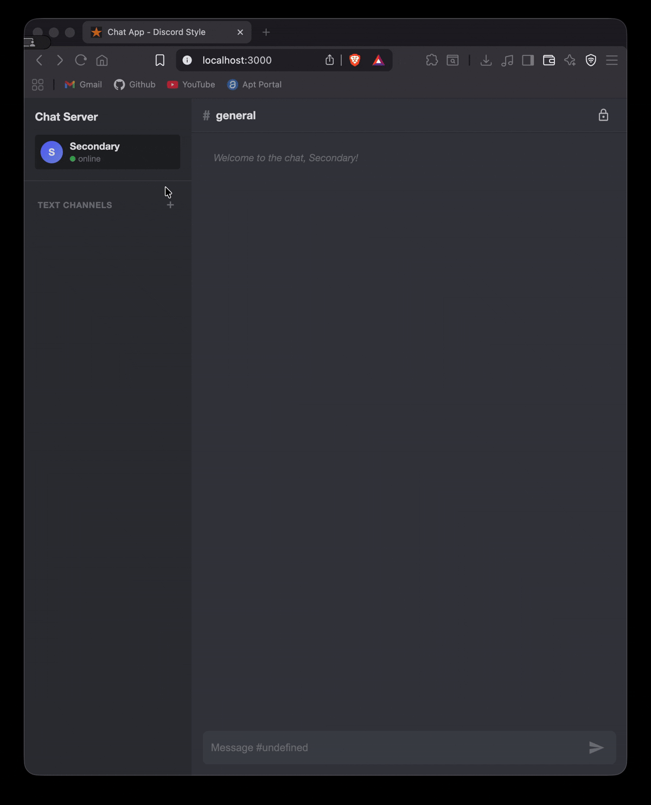

# Chat Application

A distributed, real-time chat application built with a microservices architecture, featuring WebSocket communication, event streaming with Kafka, and distributed database with ScyllaDB.

<!-- Add architecture diagram here -->


## Table of Contents

- [Overview](#overview)
- [Architecture](#architecture)
  - [System Components](#system-components)
  - [Technology Stack](#technology-stack)
  - [Data Flow](#data-flow)
- [Prerequisites](#prerequisites)
- [Getting Started](#getting-started)
  - [1. Clone the Repository](#1-clone-the-repository)
  - [2. Start Infrastructure Services](#2-start-infrastructure-services)
  - [3. Start Backend Services](#3-start-backend-services)
  - [4. Start Frontend](#4-start-frontend)
- [Project Structure](#project-structure)
- [Configuration](#configuration)
- [Development](#development)
- [API Documentation](#api-documentation)
- [Troubleshooting](#troubleshooting)

---

## Overview

This chat application is a Discord-inspired, distributed messaging platform that demonstrates modern microservices architecture patterns. It supports real-time messaging across multiple channels with user presence tracking and message persistence.

### Key Features

- 🚀 **Real-time messaging** using WebSocket with STOMP protocol
- 📡 **Event-driven architecture** with Apache Kafka for message streaming
- 💾 **Distributed database** using ScyllaDB (Cassandra-compatible)
- 🔄 **Message persistence** with dedicated persistence service
- 👥 **Multi-channel support** with user presence tracking
- 🎨 **Modern UI** with Discord-inspired dark theme
- 📱 **Responsive design** for various screen sizes
- 🔌 **SockJS fallback** for WebSocket compatibility

---

## Architecture

### System Components

The application consists of four main components:

#### 1. **Chat Frontend** (`chat-frontend/`)
- Single-page application built with vanilla JavaScript and Webpack
- WebSocket client using STOMP over SockJS
- Real-time message rendering and channel management
- Protobuf message deserialization

#### 2. **Chat Backend** (`chat-backend/`)
- Spring Boot application serving as the WebSocket server
- Handles real-time client connections via STOMP
- Produces messages to Kafka topics
- Consumes live updates from Kafka for WebSocket broadcast
- Queries ScyllaDB for message history and channel data
- Provides REST API endpoints for chat operations

#### 3. **DB Persistence Service** (`db-persistence/`)
- Dedicated microservice for database operations
- Kafka consumer that persists chat messages to ScyllaDB
- Decouples persistence logic from the main backend
- Ensures data consistency across the distributed system

#### 4. **Infrastructure Services**
- **Apache Kafka**: Message broker with 3-broker cluster (ports 9092, 9094, 9096)
- **ScyllaDB**: 3-node distributed database cluster (ports 9042, 9043, 9044)

### Technology Stack

| Component | Technologies |
|-----------|-------------|
| **Frontend** | JavaScript (ES6+), Webpack, STOMP.js, SockJS, Protobuf.js |
| **Backend** | Java 17, Spring Boot 3.5.6, Spring WebSocket, Spring Kafka |
| **Persistence** | Java 17, Spring Boot 3.5.6, Kafka Streams |
| **Message Broker** | Apache Kafka (multi-broker cluster) |
| **Database** | ScyllaDB 3.11.5.9 (Cassandra-compatible) |
| **Serialization** | Protocol Buffers (Protobuf) |
| **Build Tools** | Gradle 8.x, npm/Webpack 5 |
| **Containerization** | Docker & Docker Compose |

### Data Flow

#### Message Publishing Flow
```
1. User sends message via Frontend
2. Frontend → WebSocket/STOMP → Chat Backend
3. Chat Backend → Kafka Topic (e.g., "chat-messages")
4. DB Persistence Service consumes from Kafka
5. DB Persistence Service → ScyllaDB (message stored)
```

#### Message Consumption Flow
```
1. Chat Backend listens to Kafka topics
2. New message arrives on Kafka topic
3. Chat Backend broadcasts to all connected WebSocket clients
4. Frontend receives and displays message in real-time
```

<!-- Add sequence diagram here -->


---

## Prerequisites

Before running the application, ensure you have the following installed:

- **Java Development Kit (JDK) 17+**
  ```bash
  java -version
  ```

- **Node.js 14+ and npm**
  ```bash
  node --version
  npm --version
  ```

- **Docker and Docker Compose** (for ScyllaDB)
  ```bash
  docker --version
  docker-compose --version
  ```

- **Apache Kafka** (running on ports 9092, 9094, 9096)
  - Download from: https://kafka.apache.org/downloads
  - Or use a Docker-based setup

- **Gradle** (wrapper included in projects)

---

## Getting Started

### 1. Clone the Repository

```bash
git clone <repository-url>
cd chat-app
```

### 2. Start Infrastructure Services

#### Start ScyllaDB Cluster and Kafka

The application uses a 3-node ScyllaDB cluster for high availability.

```bash
# Start ScyllaDB using Docker Compose
docker-compose up -d

# Verify all nodes are running
docker ps

# Wait for the cluster to initialize (may take 1-2 minutes)
docker exec -it scylla nodetool status
```

You should see 3 nodes with status "UN" (Up/Normal).

### 3. Start Backend Services

#### Start DB Persistence Service

```bash
cd db-persistence

# Build the project
./gradlew build

# Run the service
./gradlew bootRun
```

The persistence service will start consuming messages from Kafka and persisting them to ScyllaDB.

#### Start Chat Backend

Open a new terminal:

```bash
cd chat-backend

# Build the project
./gradlew build

# Run the backend server
./gradlew bootRun
```

The backend will start on `http://localhost:8080` and begin listening for WebSocket connections.


### 4. Start Frontend

Open a new terminal:

```bash
cd chat-frontend

# Install dependencies (first time only)
npm install

# Start development server
npm run dev
```

The frontend will be available at `http://localhost:8081` (or the port shown in console).




### 5. Verify Everything is Running

- **Frontend**: http://localhost:8081
- **Backend**: http://localhost:8080
- **ScyllaDB**: localhost:9042, 9043, 9044
- **Kafka**: localhost:9092, 9094, 9096

---

## Project Structure

```
chat-app/
├── chat-frontend/           # Frontend application
│   ├── js/                  # JavaScript source files
│   │   ├── app.js          # Main application logic
│   │   └── config.js       # Configuration
│   ├── css/                # Stylesheets
│   ├── webpack.*.js        # Webpack configuration
│   └── package.json        # npm dependencies
│
├── chat-backend/           # WebSocket & API backend
│   ├── src/
│   │   └── main/
│   │       ├── java/       # Java source files
│   │       └── resources/
│   │           └── application.properties
│   └── build.gradle        # Gradle build configuration
│
├── db-persistence/         # Database persistence service
│   ├── src/
│   │   └── main/
│   │       ├── java/       # Java source files
│   │       └── resources/
│   │           └── dbpersistence.properties
│   └── build.gradle        # Gradle build configuration
│
├── proto/                  # Protocol Buffer definitions
│   ├── chat-message.proto
│   ├── user-updates.proto
│   ├── channel-updates.proto
│   └── common.proto
│
└── docker-compose.yaml     # ScyllaDB cluster configuration
```

---

## Configuration

### Backend Configuration

Edit `chat-backend/src/main/resources/application.properties`:

```properties
# Kafka Configuration
spring.kafka.consumer.bootstrap-servers=localhost:9092,localhost:9094,localhost:9096
spring.kafka.producer.bootstrap-servers=localhost:9092,localhost:9094,localhost:9096

# ScyllaDB Configuration
scylla.host=localhost
scylla.ports=9042,9043,9044
scylla.datacenter=DC1
scylla.keyspace=chat_app
```

### Persistence Service Configuration

Edit `db-persistence/src/main/resources/dbpersistence.properties`:

```properties
# Kafka Configuration
kafka.consumer.bootstrap-servers=localhost:9092,localhost:9094,localhost:9096

# ScyllaDB Configuration
scylla.host=localhost
scylla.ports=9042,9043,9044
```

### Frontend Configuration

Edit `chat-frontend/js/config.js`:

```javascript
export const config = {
    websocketUrl: 'http://localhost:8080/ws',
    apiBaseUrl: 'http://localhost:8080/api'
};
```

---

## Development

### Building the Projects

```bash
# Build backend
cd chat-backend
./gradlew clean build

# Build persistence service
cd ../db-persistence
./gradlew clean build

# Build frontend
cd ../chat-frontend
npm run build
```

### Generating Protobuf Files

The Protobuf files are automatically generated during the build process. To manually regenerate:

```bash
cd chat-backend
./gradlew generateProto
```

### Hot Reload Development

- **Frontend**: Webpack dev server supports hot reload by default (`npm run dev`)
- **Backend**: Use Spring Boot DevTools or restart after changes

---

## API Documentation

### WebSocket Endpoints

**Connection URL**: `ws://localhost:8080/ws`

#### STOMP Destinations

| Destination                  | Type | Description                    |
|------------------------------|------|--------------------------------|
| `/app/chat.send`             | Send | Send a chat message            |
| `/topic/channel/{channelId}` | Subscribe | Receive messages for a channel |
| `/topic/user`        | Subscribe | Receive user status updates    |
| `/topic/channel`     | Subscribe | Receive channel status updates |

### REST API Endpoints

| Method | Endpoint                               | Description             |
|--------|----------------------------------------|-------------------------|
| GET    | `/api/v1/channel/all`                  | List all channels       |
| GET    | `/api/v1/channel/{channelId}`          | Get Channel by ID       |
| GET    | `/api/v1/channel/name/{channelName}`   | Get Channel by Name     |
| GET    | `/api/v1/message/{ChannelId}/messages` | Get message history     |
| POST   | `/api/v1/channel/`                     | Create a new Channel    |
| GET    | `/api/v1/user/{userId}`                | Get User by ID          |
| GET    | `/api/v1/user/all`                     | Get All Users           |
| POST   | `/api/user/`                           | Create a new user       |
| POST   | `/api/v1/message/{channelName}/send`   | Send message on Channel |

<!-- Add API usage example screenshot here -->


---

## Troubleshooting

### Common Issues

#### 1. **Cannot connect to ScyllaDB**

```bash
# Check if containers are running
docker ps

# Check logs
docker logs some-scylla

# Restart cluster
docker-compose restart
```

#### 2. **Kafka connection refused**

- Verify Kafka brokers are running on ports 9092, 9094, 9096
- Check `advertised.listeners` in Kafka configuration
- Ensure topics are created

#### 3. **WebSocket connection failed**

- Verify backend is running on port 8080
- Check browser console for errors
- Verify firewall/security settings

#### 4. **Messages not persisting**

- Check DB Persistence service logs
- Verify Kafka consumer group is active
- Check ScyllaDB connection and schema

#### 5. **Frontend build errors**

```bash
# Clean install
rm -rf node_modules package-lock.json
npm install
```

### Logs

```bash
# Backend logs
cd chat-backend
./gradlew bootRun --info

# Persistence service logs
cd db-persistence
./gradlew bootRun --info

# Docker logs
docker logs some-scylla
docker logs some-scylla2
docker logs some-scylla3
```

---

**Built with ❤️ for distributed systems**

